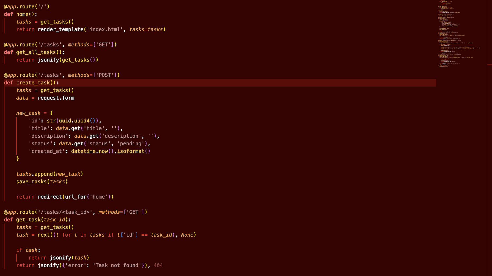

# Flask CRUD Application

A simple task management application built with Flask that demonstrates CRUD operations (Create, Read, Update, Delete).


## Features

- Create new tasks with title, description, and status
- View all tasks in a responsive card layout
- Update existing tasks through a modal form
- Delete tasks you no longer need
- Simple file-based JSON storage
- Responsive design for mobile and desktop

## Application Structure

\`\`\`bash
flask-crud-app/
├── app/
│   └── api/
│       ├── index.py         # Main Flask application
│       ├── tasks.json       # Data storage file (generated)
│       └── templates/
│           └── index.html   # HTML template with CSS and JS
├── screenshots/             # Application screenshots
├── requirements.txt         # Python dependencies
├── vercel.json             # Vercel deployment configuration
└── README.md               # This documentation
\`\`\`

## Code Explanation

### 1. Flask Application (index.py)

The main application file handles all routes and CRUD operations:



Key components:
- File-based JSON database for storing tasks
- Routes for creating, reading, updating, and deleting tasks
- Simple data validation and error handling

```python
# Example of the create_task route
@app.route('/tasks', methods=['POST'])
def create_task():
    tasks = get_tasks()
    data = request.form
    
    new_task = {
        'id': str(uuid.uuid4()),
        'title': data.get('title', ''),
        'description': data.get('description', ''),
        'status': data.get('status', 'pending'),
        'created_at': datetime.now().isoformat()
    }
    
    tasks.append(new_task)
    save_tasks(tasks)
    
    return redirect(url_for('home'))
