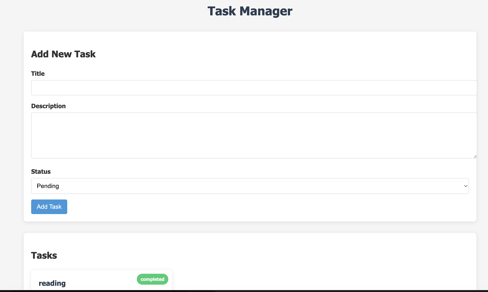
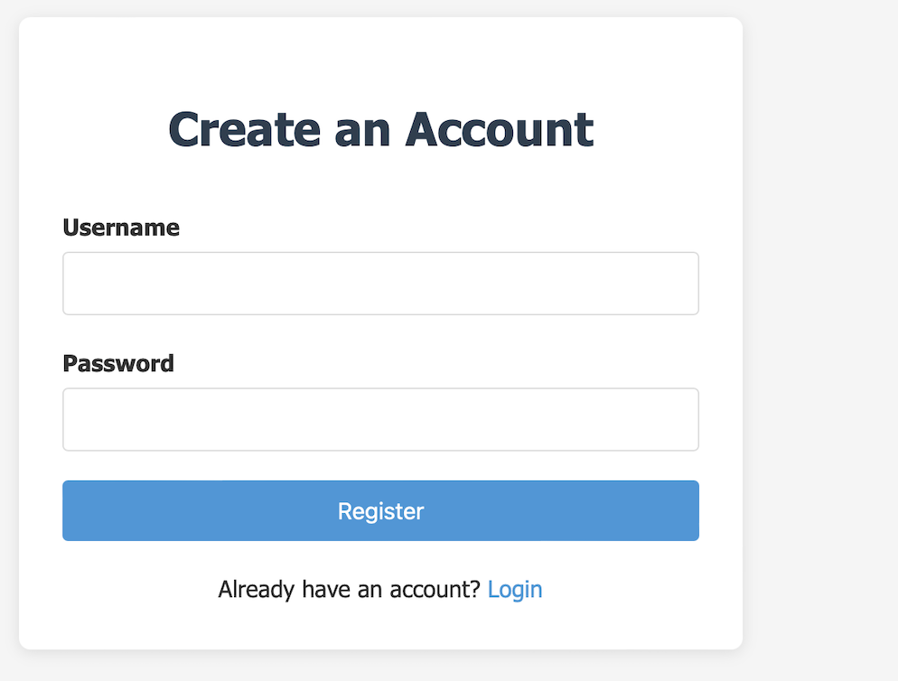
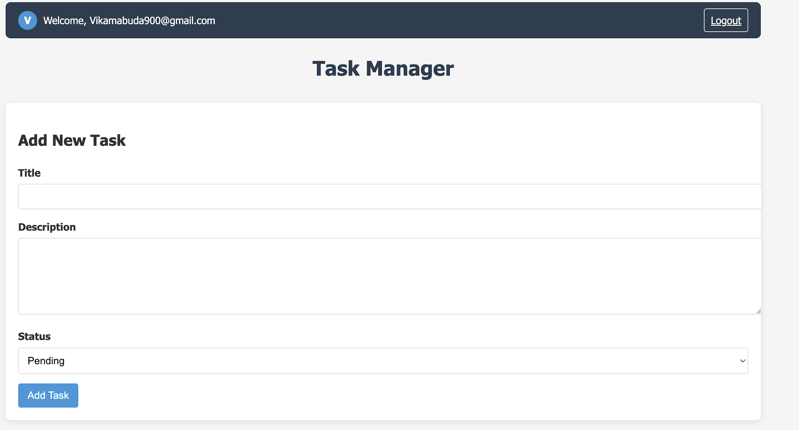
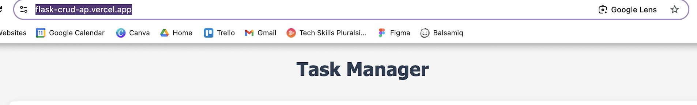

# Multi-User Flask CRUD Application

A task management application built with Flask that demonstrates CRUD operations (Create, Read, Update, Delete) with multi-user support.

## Features

- User registration and authentication
- Secure password storage with hashing
- User-specific tasks (users can only see and manage their own tasks)
- Create new tasks with title, description, and status
- View all tasks in a responsive card layout
- Update existing tasks through a modal form
- Delete tasks you no longer need
- Simple file-based JSON storage
- Responsive design for mobile and desktop

## Application Structure

\`\`\`bash
flask-crud-app/
├── app/
│   └── api/
│       ├── index.py         # Main Flask application
│       ├── tasks.json       # Tasks data storage file (generated)
│       ├── users.json       # Users data storage file (generated)
│       └── templates/
│           ├── index.html   # Main application template
│           ├── login.html   # Login page template
│           └── register.html # Registration page template
├── screenshots/             # Application screenshots
├── requirements.txt         # Python dependencies
├── vercel.json             # Vercel deployment configuration
└── README.md               # This documentation
\`\`\`

## Code Explanation

### 1. Authentication System

The application implements a complete user authentication system:

Key components:
- User registration with username and password
- Secure password hashing using SHA-256
- Session management to track logged-in users
- Protection of routes to ensure only authenticated users can access them

### 2. Task Management with User Isolation

Each task is associated with a specific user:

Key features:
- Tasks are filtered by user ID
- Users can only see and modify their own tasks
- All CRUD operations check for user ownership

### 3. User Interface

The application provides a complete user interface:

Key features:
- Login and registration forms
- User information display
- Logout functionality
- Task management interface

## How to Run Locally

1. Clone this repository:
   \`\`\`bash
   git clone https://github.com/yourusername/flask-crud-app.git
   cd flask-crud-app
   \`\`\`

2. Create a virtual environment:
   \`\`\`bash
   python -m venv venv
   source venv/bin/activate  # On Windows: venv\Scripts\activate
   \`\`\`

3. Install dependencies:
   \`\`\`bash
   pip install -r requirements.txt
   \`\`\`

4. Run the application:
   \`\`\`bash
   python app/api/index.py
   \`\`\`

5. Open your browser and navigate to `http://127.0.0.1:5000`

## Deployment

This application is deployed on Vercel at [your-app-url.vercel.app](https://your-app-url.vercel.app).

To deploy your own version:

1. Fork this repository
2. Sign up on [Vercel](https://vercel.com)
3. Create a new project and import your GitHub repository
4. Vercel will automatically detect the configuration and deploy your app
5. You'll receive a public URL like `https://your-app-name.vercel.app`

## Security Considerations

This application implements basic security features:
- Password hashing to protect user credentials
- Session management for authentication
- User isolation to prevent access to other users' data

For a production application, consider these additional security measures:
- Use a more secure password hashing algorithm like bcrypt
- Implement CSRF protection
- Add rate limiting for login attempts
- Use HTTPS for all communications
- Implement proper input validation and sanitization

## Limitations and Future Improvements

- The current implementation uses file-based storage, which is not suitable for production
- For a production application, consider using a proper database like SQLite, PostgreSQL, or MongoDB
- Add email verification for user registration
- Implement password reset functionality
- Add task sharing between users
- Implement task categories and due dates

## License

MIT
